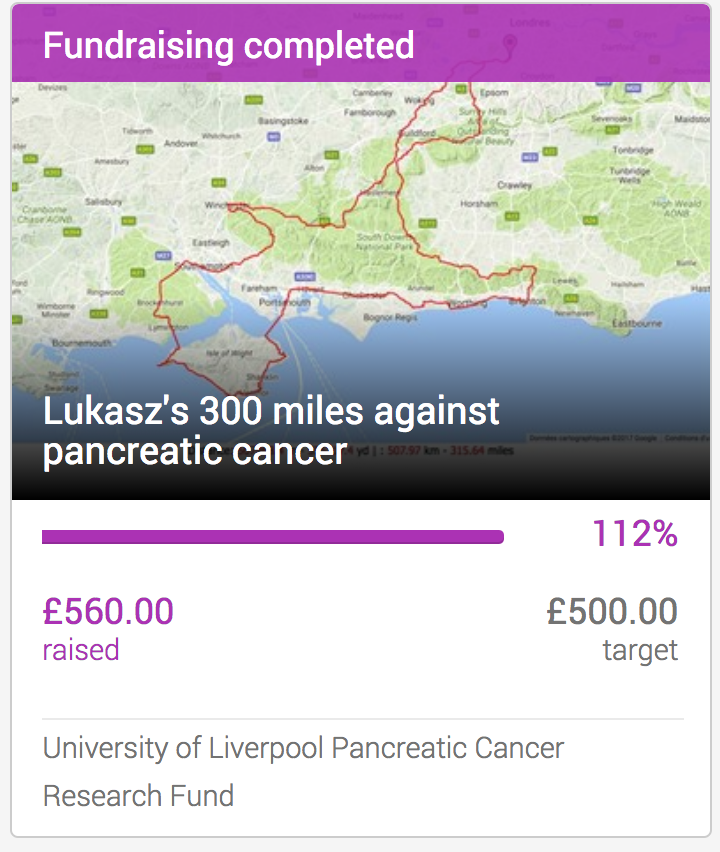
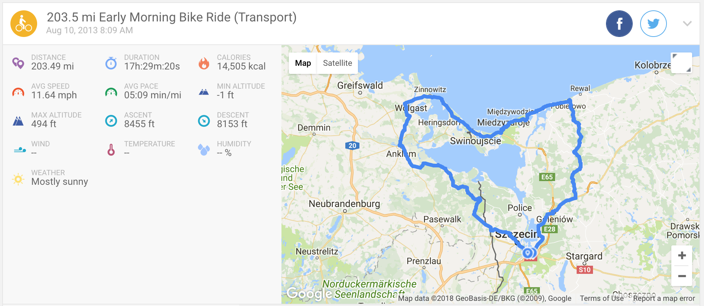
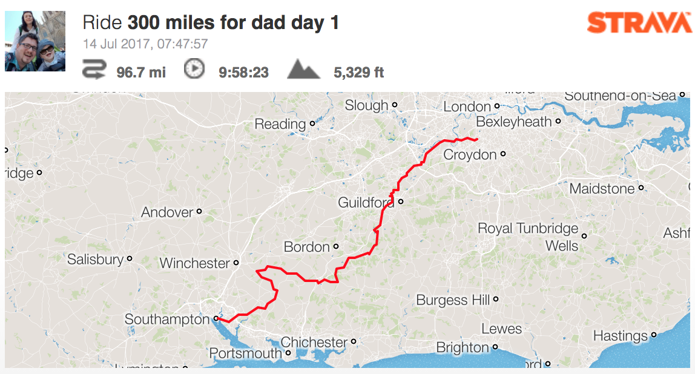
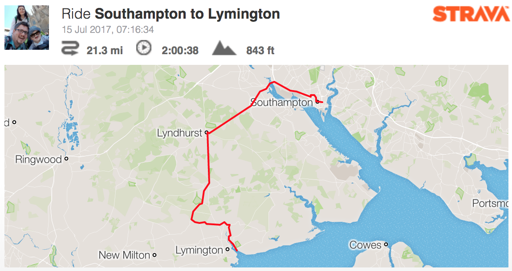
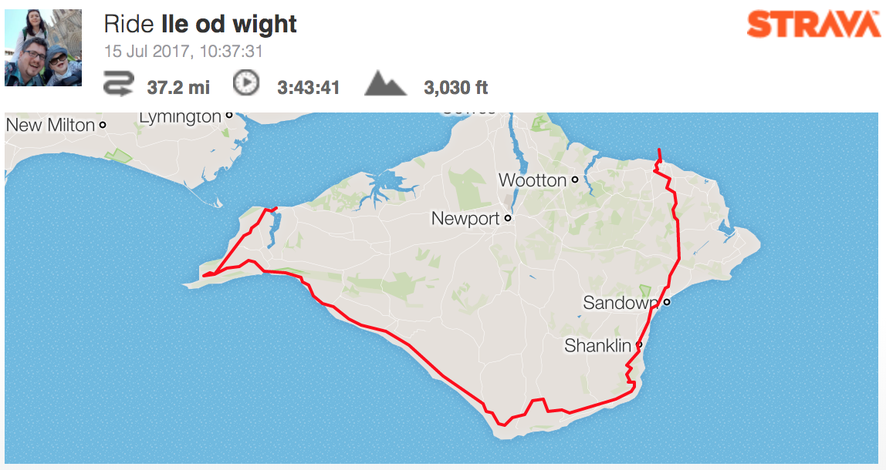
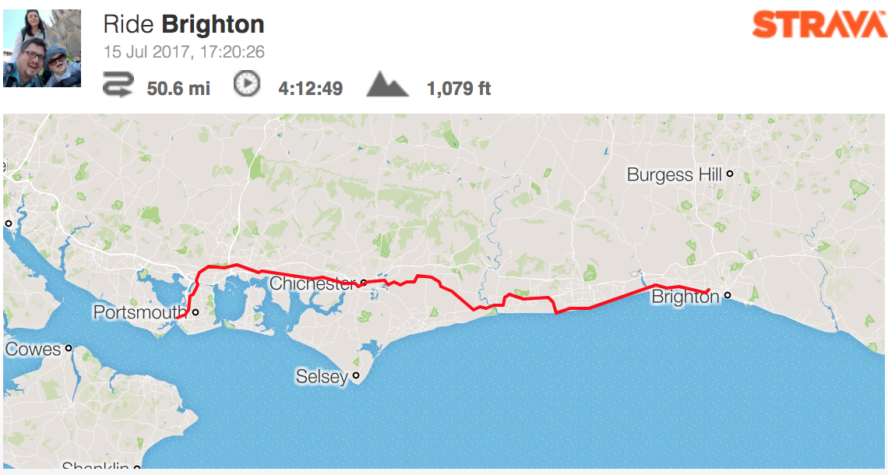
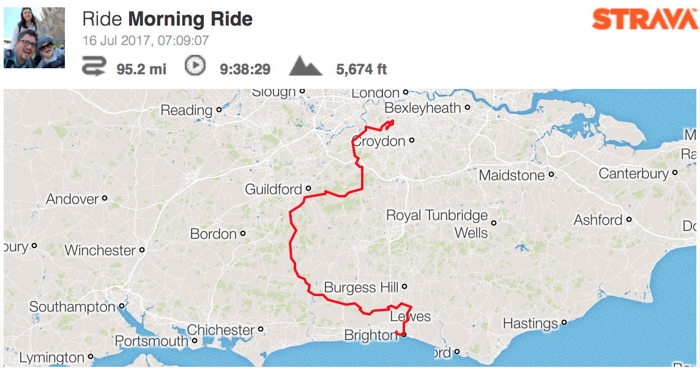

(article is still a draft, I will try to add notes along the way)

In 2017 I made my lone three-day trip to [fundraise](https://www.justgiving.com/fundraising/300mfordad) for pancreatic cancer research fund on University of Liverpool.
The idea was plain simple. I recently became a father to a lovely boy. I wanted to invest in my own health for him,
having in mind that years ago I lost my own father to pancreatic cancer. Planning long cycle ride is a great target
to keep the mind on staying fit and looking after yourself. Cycling challenge is a good way to give your minimal input
to the cause.

I was hugely influenced by the event that my friend participate to [Informatycy Na Rowery](http://informatycynarowery.pl/) where they cycle to fundraise
to support various causes, mostly medical treatment for children. and would like to make a small version of their
cause in the UK.

Last, but not least important I found cycling a great way to sign a life milestone when I did 200 miles in two days
just a few days before my own wedding - in [shape of a heart](https://www.endomondo.com/users/4516509/workouts/2292226860).

Route was published on my instagram and this [Facebook Fan Page](https://www.facebook.com/300milesfordad/).

## Day 1

### Start in Raynes Park, London

<instagram-embed url='https://www.instagram.com/p/BWhJATTlMS7/' maxWidth={320} hideCaption={false} containerTagName='div'/>

### Rogate

<instagram-embed url='https://www.instagram.com/p/BWh-QI_lPDd/' maxWidth={320} hideCaption={false} containerTagName='div'/>

### Petersfield

<instagram-embed url='https://www.instagram.com/p/BWiBJCOl6ZI/' maxWidth={320} hideCaption={false} containerTagName='div'/>

### Southampton

<instagram-embed url='https://www.instagram.com/p/BWisgrOFP7r/' maxWidth={320} hideCaption={false} containerTagName='div'/>

## Day 2

### New Forest

<instagram-embed url='https://instagram.com/p/BWj9GGrlIh7' maxWidth={320} hideCaption={false} containerTagName='div'/>

### Isle of Wight

<instagram-embed url='https://instagram.com/p/BWkSv9Plc9z' maxWidth={320} hideCaption={false} containerTagName='div'/>

<instagram-embed url='https://instagram.com/p/BWkreUqFj9s' maxWidth={320} hideCaption={false} containerTagName='div'/>

### Roll to Brighton

<instagram-embed url='https://instagram.com/p/BWlLZ6MlX2g' maxWidth={320} hideCaption={false} containerTagName='div'/>

## Day 3

### Climbing the Downs

<instagram-embed url='https://instagram.com/p/BWmYVE1l2No' maxWidth={320} hideCaption={false} containerTagName='div'/>

<instagram-embed url='https://instagram.com/p/BWmvQpJFlR1' maxWidth={320} hideCaption={false} containerTagName='div'/>

### Vintage Rose Tea Rooms

<instagram-embed url='https://instagram.com/p/BWmvRgSlivi' maxWidth={320} hideCaption={false} containerTagName='div'/>

### Petworth

<instagram-embed url='https://instagram.com/p/BWm1HjYFUgg' maxWidth={320} hideCaption={false} containerTagName='div'/>

### On the way back

<instagram-embed url='https://instagram.com/p/BWnY_WJFJXO' maxWidth={320} hideCaption={false} containerTagName='div'/>

