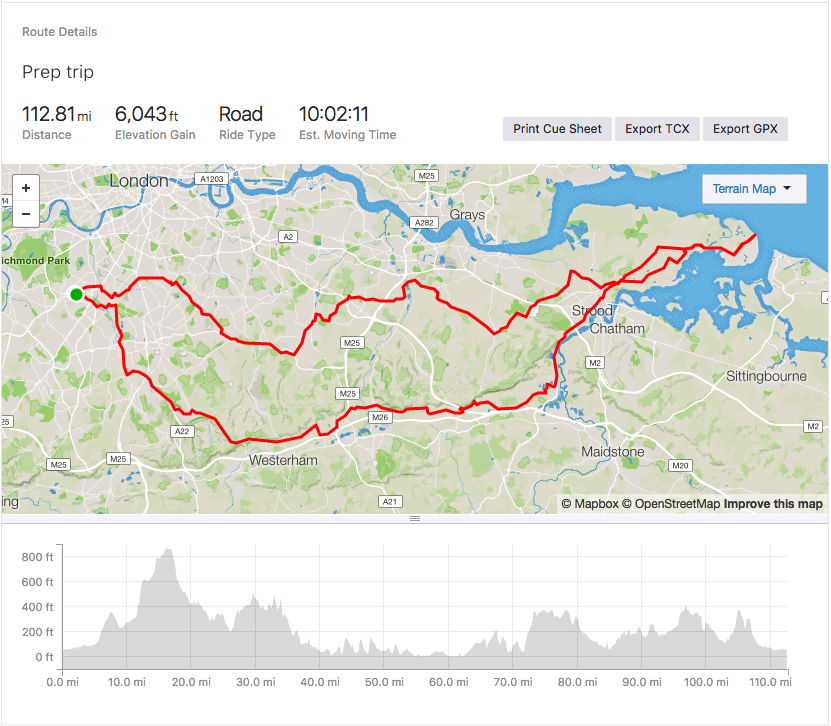
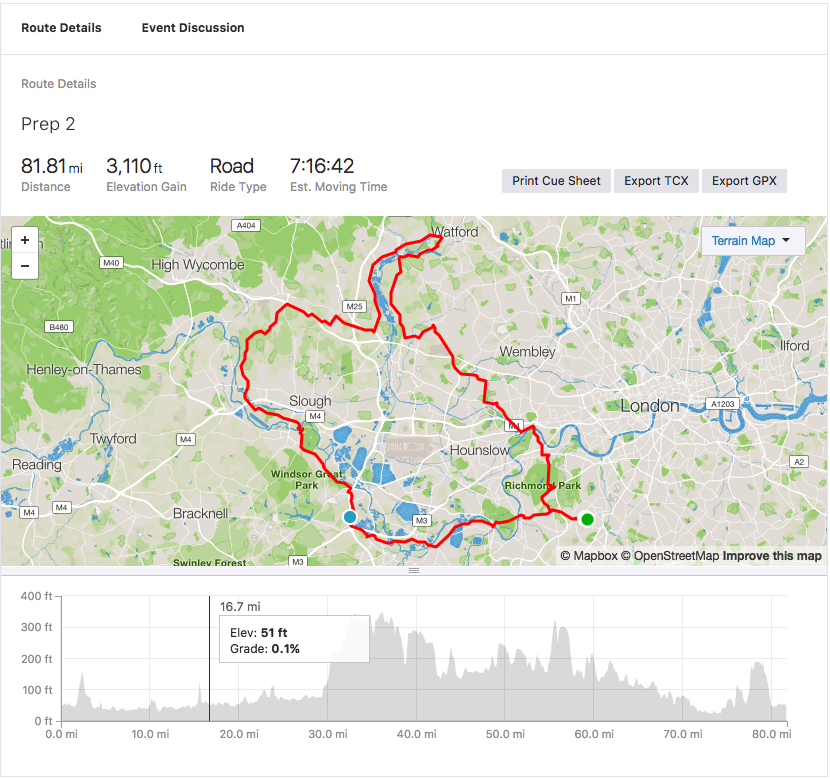

Almost every day I do 20 miles cycle and gym workout, connected with intermittent fasting and low carb regime to prepare for the trip. But for a really good preparation, we need a bit more. Therefore I "organise" two longer trips (details may change depending on the weather).

## Sunday, July 15th

Easy 112 miles from Wimbledon, via Surrey Hills to Isle of Grain and back via South London. Starts hilly, but then mainly flat. Nice views included. Leaving about 7-8 am.

[Join on Strava](https://www.strava.com/clubs/446772/group_events/352243)

## Sunday, July 22nd

Even easier 81 miles from Wimbledon to Windsor, then up Chiltern to Gerrards Cross and later almost to Watford and back via Richmond Park. Nice climb, but mostly rolling hills. STart about 7-8am. Be prepared for Pheasants and Muntjacs.

[Join on Strava](https://www.strava.com/clubs/446772/group_events/352249)