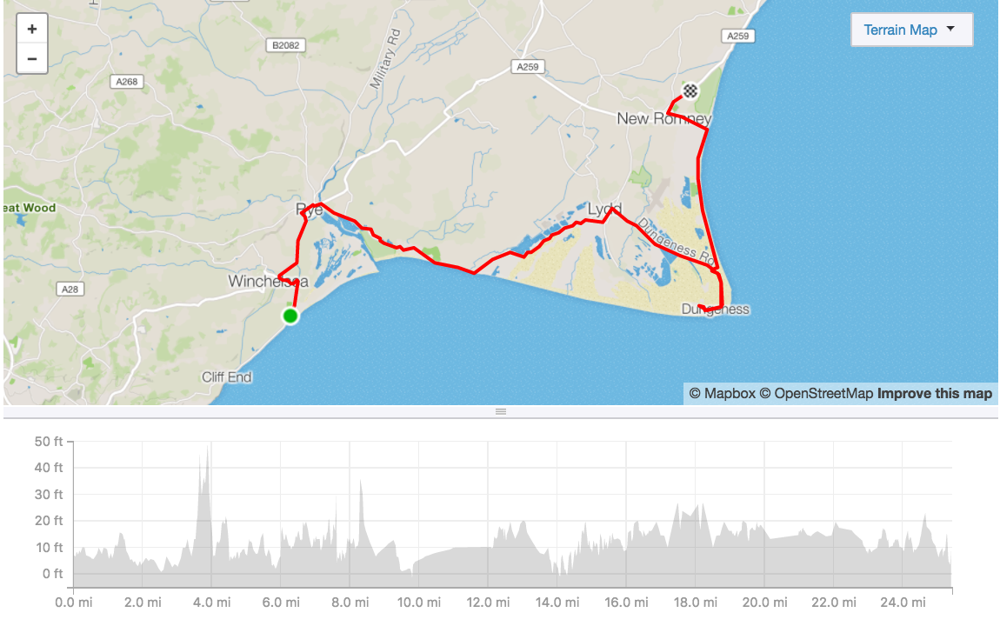
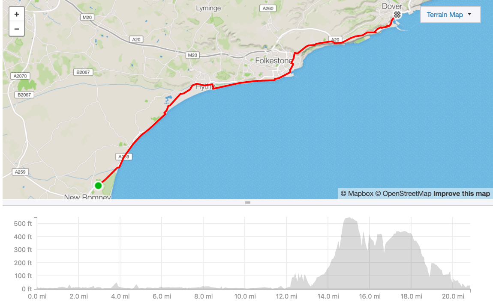

I was just finishing my last prep workout. Made [70 miles](https://www.strava.com/activities/1721205782) from Wimbledon, via Windsor, Watford and back to London. I stopped for a moment in Patisserie Valerie on Marble Arch. Chained my bike in front of the entrance. Cameras were there and people were sitting in front of the place. I went inside, started to drink coffee and charge my phone a bit before cycling next 20 miles home. I went out the coffee and there was no bike.

People outside saw someone taking it. They did not bother to react. The camera caught the act and manager saved record for the police. It took me 1 hour to dial them. They took all the info and told it will take one week to collect the recording. I was crushed. Went back by foot to St. James's Park station, shaking and wet eyes from anger and helplessness.

This was a great Jamis Allegro 28" hybrid I made thousands of miles with. Quite unique for the UK so thief either will put it to parts or "I'll find him". I had it for over 5 years and it was still ready for action. Some might say - time for a new one. Yes. But, a good bike is like a ship or a car. You feel attached.

What pissed me more, was the impression that whole action of fundraising may fall apart. But actually, I just got stronger in my plans. I don't have enough time to find, buy and wear a new bike before. Not saying about the gear.

If I can't cycle 500 miles in 5 days. I will walk 5 marathons in 5 days. Earn enough karma against that soulless, pathetic thief as possible.

The plan is to take a train to Brighton and start a walk from there. Abou 26 miles a day. With my average pace around 22 minutes per mile, it would take me 8 hours of walking per day. It makes perfect sense to plan 12 hours trek which was similar to the original plan.

The goal is to walk each day 26.26 miles according to my Fitbit tracker (using GPS). That may add some mileage while breaks, but I will use the same set of legs for it.

As I'd travel light and will have breaks in more convenient places I'll charge my phone more often during the day and be able to choose from a bigger number of camping sites.

I will walk on the shore so will follow:

[Aug 1st](https://www.strava.com/routes/14502212)

Leaving Brighton around 8, on the beach towards Newhaven, then Seaford, Seven Sisters and ending in Eastbourne.

[Aug 2nd](https://www.strava.com/routes/14502404)

A flat trip from Eastbourne to Hastings, and after a nice climb there end in Winchelsea.

[Aug 3rd](https://www.strava.com/routes/14502513)

Via Rye to Lydd and then Dungeness and Lydd-at-Sea. Later New Romney. Mostly flat and wet.

[Aug 4th](https://www.strava.com/routes/14502542)

Flat to Hythe and Folkestone. Then climb there on white cliffs to Dover.

[Aug 5th](https://www.strava.com/routes/14502561)

After walking down the cliffs, Deal, Ramsgate to Margate. Train back home.

If you want to join me on any part - feel free. I will be walking quite brisk. Doing short breaks. Eating light foods, mostly from groceries. Will sleep on camping sites in a tent. The whole trip will be documented on camera and will post it on Instagram.

I hope it will be enough to convince you to support Szymon and buy him a proper badass sports wheelchair.